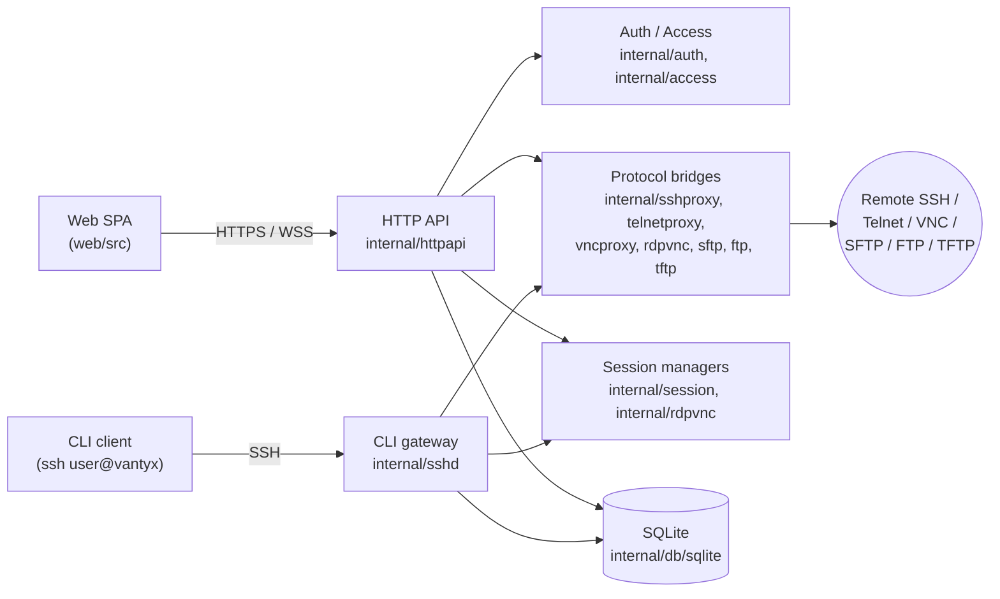

<p align="center">
  <picture>
    <source media="(prefers-color-scheme: dark)" srcset="web/public/logo-dark.svg">
    
  </picture>
</p>

# Vantyx

[English](README.md)

[](https://github.com/nullpo7z/vantyx/actions/workflows/ci-dev.yml)
[](LICENSE)

Vantyx は、ブラウザや CLI クライアントと SSH / Telnet / RDP / VNC / SFTP /
FTP / TFTP サーバーをつなぐセルフホスト型のアクセスゲートウェイです。
1 コンテナで完結し、自身で TLS を終端、状態は SQLite に永続化、同梱の
シングルページ UI 向けに統一的な REST + WebSocket API を提供します。

## 特長

- **ブラウザターミナル**（SSH / Telnet、xterm.js + WebSocket）：セッション再開、NAWS、永続シェル、SSH ホスト鍵の TOFU（信頼オンファースト利用）とフィンガープリント登録。
- **共同ターミナルセッション**（SSH / Telnet）：同一セッションに複数ユーザーを招待。1 人だけ書き込み（write token）、他は閲覧専用。指名招待・リンク招待、操作権のリクエスト/付与、SSE による UI 同期。詳細は [docs/collaborative-sessions.md](docs/collaborative-sessions.md)。
- **ブラウザリモートデスクトップ**：VNC（noVNC）。RDP ターゲットは xfreerdp + Xvfb + x11vnc 経由（ブラウザから接続）。VNC への共同参加は [ロードマップ](docs/roadmap.md)参照。
- **ファイル転送**：SFTP / FTP / リモート TFTP、および組み込み TFTP サーバー（機器プロビジョニング向け）。バックグラウンド転送ジョブと進捗 SSE。
- **資格情報ライブラリ**（管理者）：**Keys**（SSH 秘密鍵のみ）と **Identities**（ユーザー名 + 認証方式）を分離管理。サーバー登録時に Identity / Key / 手入力から選択。 [docs/credentials.md](docs/credentials.md)。
- **階層型アクセスグループ**（`net/tokyo` は `net` の権限を継承）と**タグベースのアクセス制御**：グループ・ターゲット・ユーザーへのタグ付与で、誰がどのサーバーに接続できるかを制御。詳細は [docs/access-control.md](docs/access-control.md)。
- **CLI ゲートウェイ**：`ssh user@vantyx` で Vantyx にログインし、許可されたターゲットへプロキシ接続。
- **セッション録画**：ターミナル/CLI は asciinema `.cast`、RDP/VNC 画面録画は H.264 `.mp4`。UI で再生・GIF/MP4 書き出し（バックグラウンド変換）。
- **監査パイプライン**：API 呼び出し・セッションイベントを記録し、外部 syslog / SIEM へ転送可能。
- **OWASP ASVS Level 2** の精神に倣う機密データ保存・通信のベースライン（正式監査ではなくベストエフォート）。

## クイックスタート（Docker）

公開イメージ: [`nullpo7z/vantyx:latest`](https://hub.docker.com/r/nullpo7z/vantyx)

```bash
git clone https://github.com/nullpo7z/vantyx.git
cd vantyx
cp .env.example .env
# .env を編集: VANTYX_EXTERNAL_HOST（ブラウザで開くホスト名/IP）と
# VANTYX_SSH_PASSWORD_ENCRYPTION_KEY（openssl rand -base64 32 で生成）
# docker-compose.yml の /path/to/vantyx を実際のパスに変更（例: /opt/vantyx）
mkdir -p /path/to/vantyx/{certs,data,recordings}

docker compose pull    # nullpo7z/vantyx:latest を取得（ローカルビルドは不要）
docker compose up -d   # docker-compose.yml（実運用向け）
```

ブラウザで `https://<VANTYX_EXTERNAL_HOST>/` を開きます（自己署名 TLS のため警告が出る場合があります）。

ソースから開発用イメージをビルドする場合のみ [docker-compose.dev.yml](docker-compose.dev.yml) を使います:

```bash
docker compose -f docker-compose.dev.yml up --build -d
```

| ポート   | 用途                                                                                              |
|----------|---------------------------------------------------------------------------------------------------|
| `80`     | 常に HTTPS へ 301 リダイレクト（無効化不可）                                                       |
| `443`    | アプリ本体（REST API + SPA）。コンテナ内では `8080` / `8443` で待ち受け。                          |
| `2222`   | CLI SSH ゲートウェイ（`ssh -p 2222 admin@<host>`）                                                |
| `69/udp` | コンテナ内 `6969/udp` の組み込み TFTP サーバーへ転送。                                             |

- **TLS**: 初回起動時に自己署名証明書を `/path/to/vantyx/certs` へ生成。本番では
  `VANTYX_TLS_CERT_FILE` / `VANTYX_TLS_KEY_FILE` でマウントするか、
  `VANTYX_TLS_SANS` を設定してから `certs` を削除して再生成してください。
- **初期管理者**: ユーザー名は `admin`。`VANTYX_INITIAL_ADMIN_PASSWORD` 未設定時は初回起動でランダムパスワードがコンテナログに一度だけ出力されます。初回ログイン後に必ず変更してください。事前に決める場合は `.env` に `VANTYX_INITIAL_ADMIN_PASSWORD` を設定してください。
- **データ永続化**: ホストの `/path/to/vantyx/data`（SQLite）と
  `/path/to/vantyx/recordings`（録画）。`docker-compose.yml` のパスを起動前に作成・編集してください。

| Compose ファイル | 用途 |
|------------------|------|
| [docker-compose.yml](docker-compose.yml) | **実運用** — `nullpo7z/vantyx:latest` を pull して起動（`build` なし） |
| [docker-compose.dev.yml](docker-compose.dev.yml) | **開発** — リポジトリから `docker compose … up --build` |

## アーキテクチャ



詳細は [docs/ARCHITECTURE.md](docs/ARCHITECTURE.md) を参照してください（英語のみ）。
公開 REST + WebSocket API は [docs/api/openapi.yaml](docs/api/openapi.yaml)
にドキュメント化され、管理者は `/docs`（Swagger UI）から参照できます。

## 設定

全ての実行時設定は `VANTYX_*` 名前空間にあります。完全な一覧は
[docs/configuration.md](docs/configuration.md) を参照してください。

本番環境で最低限必要な設定：

- `VANTYX_EXTERNAL_HOST` または `VANTYX_ALLOWED_HOSTS` — 安全な
  HTTP→HTTPS リダイレクトに必須。
- `VANTYX_SSH_PASSWORD_ENCRYPTION_KEY` — 運用者がターゲットレコードに
  SSH パスワードを保存する場合に必須（AES-256-GCM、OWASP ASVS V7.12）。

```bash
# 32 バイト・Base64 の鍵を生成
openssl rand -base64 32
```

この鍵をローテーションすると既存の暗号化パスワードを復号できなくなります。
鍵はシークレットマネージャー（Kubernetes Secret、AWS Secrets Manager 等）に
保管してください。

## ローカル開発

詳細は [docs/development.md](docs/development.md) を参照してください。

```bash
# バックエンド
VANTYX_EXTERNAL_HOST=localhost \
  VANTYX_TLS_CERT_FILE=./certs/tls.crt \
  VANTYX_TLS_KEY_FILE=./certs/tls.key \
  go run ./cmd/vantyx-server

# フロントエンド
cd web && npm install && npm run dev
```

lint・テスト・カバレッジ：

```bash
make fmt    # gofmt + goimports + eslint --fix
make lint   # golangci-lint + eslint
make test   # go test ./... + go vet ./...
```

## セキュリティ

Vantyx は機密データの保存・通信について
[OWASP ASVS Level 2](docs/SECURITY-ASVS-L2.md) の精神に倣うよう努めています
（正式な監査ではなくベストエフォート、ドキュメントは英語のみ）。
脆弱性報告は [SECURITY.ja.md](SECURITY.ja.md) を参照し、公開 Issue ではなく
GitHub Private Security Advisory フォームを使用してください。

## コントリビューション

バグ報告・コード・ドキュメント・翻訳を歓迎します。詳しくは
[CONTRIBUTING.ja.md](CONTRIBUTING.ja.md) を参照してください。変更履歴は
[CHANGELOG.md](CHANGELOG.md) で追跡しています。

## ライセンス

Vantyx は [Apache License 2.0](LICENSE) で配布しています。サードパーティの
クレジットは [NOTICE](NOTICE) を参照してください。
