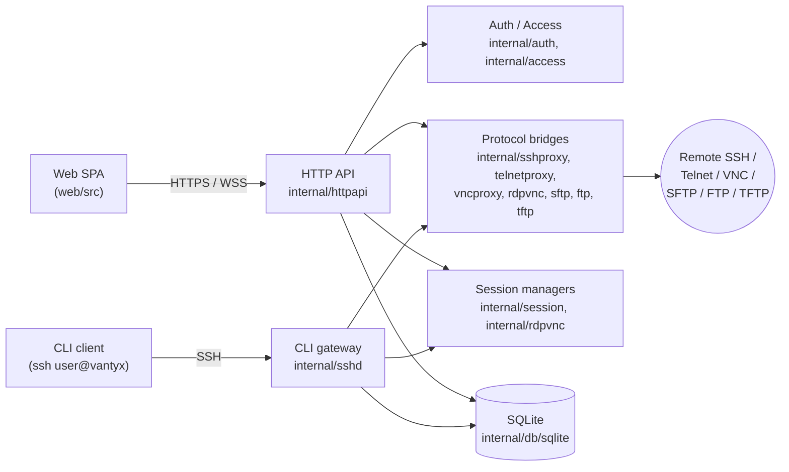

# Vantyx

[日本語](README.ja.md)

[](https://github.com/nullpo7z/vantyx/actions/workflows/ci-dev.yml)
[](LICENSE)
[](https://pkg.go.dev/github.com/nullpo7z/vantyx)

Vantyx is a self-hosted access gateway that bridges browsers and CLI clients
to the SSH, Telnet, RDP, VNC, SFTP, FTP, and TFTP servers behind it. It ships
as a single container, terminates TLS itself, persists state in SQLite, and
exposes a unified REST + WebSocket API for the bundled single-page UI.

## Highlights

- **Browser terminal** for SSH and Telnet (xterm.js + WebSocket), with
  session resume, NAWS, and persistent shells.
- **Browser remote desktop** for VNC via noVNC (RDP bridge is on the [roadmap](docs/roadmap.md)).
- **File transfer** UI for SFTP, FTP, remote TFTP, and a built-in TFTP server
  for network-equipment provisioning.
- **CLI gateway**: log into Vantyx via `ssh user@vantyx` and proxy out to
  any target you have access to.
- **Session recording**: every interactive shell can be recorded in
  asciinema format and replayed in the UI.
- **Audit pipeline**: every API call and session event is captured and can
  be forwarded to an external syslog / SIEM endpoint.
- Follows the spirit of **OWASP ASVS Level 2** (best-effort, not a formal audit) for sensitive-data storage and transport.

## Quickstart (Docker)

```bash
docker compose up --build
```

| Port    | Purpose                                                                                        |
|---------|------------------------------------------------------------------------------------------------|
| `80`    | Always 301-redirects to HTTPS (cannot be disabled).                                            |
| `443`   | The application (REST API + SPA). Inside the container the listeners bind to `8080` / `8443`. |
| `69/udp`| Forwarded to the embedded TFTP server (`6969/udp` inside the container).                       |

- **TLS**: on first start, if `/app/certs/tls.crt` and `tls.key` are absent, a
  self-signed certificate is generated and persisted in the `vantyx_certs`
  volume. Replace it by mounting your own certificate and setting
  `VANTYX_TLS_CERT_FILE` / `VANTYX_TLS_KEY_FILE`.
- **Default admin**: `admin` / `Admin123!` — change it immediately after
  first login.
- **Data persistence**: SQLite lives at `data/vantyx.db` by default. Override
  with `VANTYX_SQLITE_PATH` and mount the directory in your container.

For server-IP TLS coverage, add SANs through `VANTYX_TLS_SANS`
(comma-separated DNS names or IPs). When the value changes, delete the
`vantyx_certs` volume so the certificate is regenerated.

## Architecture



A deeper dive lives in [docs/ARCHITECTURE.md](docs/ARCHITECTURE.md). The
public REST + WebSocket surface is documented in
[docs/api/openapi.yaml](docs/api/openapi.yaml) and served from `/docs`
(Swagger UI) for administrators.

## Configuration

All runtime knobs live under the `VANTYX_*` namespace. See
[docs/configuration.md](docs/configuration.md) for the full reference.

The minimum you need to set in production:

- `VANTYX_EXTERNAL_HOST` or `VANTYX_ALLOWED_HOSTS` — required for safe
  HTTP→HTTPS redirects.
- `VANTYX_SSH_PASSWORD_ENCRYPTION_KEY` — required when operators may store
  SSH passwords on target records (AES-256-GCM at rest, OWASP ASVS V7.12).

```bash
# Generate a 32-byte key, Base64-encoded
openssl rand -base64 32
```

Rotating this key makes previously-encrypted passwords undecryptable. Store
the key in your secret manager (Kubernetes Secret, AWS Secrets Manager, …).

## Local development

See [docs/development.md](docs/development.md) for the full guide.

```bash
# Backend
VANTYX_EXTERNAL_HOST=localhost \
  VANTYX_TLS_CERT_FILE=./certs/tls.crt \
  VANTYX_TLS_KEY_FILE=./certs/tls.key \
  go run ./cmd/vantyx-server

# Frontend
cd web && npm install && npm run dev
```

Lint, test, and coverage:

```bash
make fmt    # gofmt + goimports + eslint --fix
make lint   # golangci-lint + eslint
make test   # go test ./... + go vet ./...
make e2e    # Playwright E2E (requires Docker)
```

## Security

Vantyx tries to follow the spirit of
[OWASP ASVS Level 2](docs/SECURITY-ASVS-L2.md) for sensitive data at rest
and in transit (best-effort, not a formal audit). See
[SECURITY.md](SECURITY.md) before reporting vulnerabilities — please use
the GitHub private security advisory form rather than opening a public
issue.

## Contributing

Bug reports, code, docs, and translations are all welcome. See
[CONTRIBUTING.md](CONTRIBUTING.md) for the short rundown; changes are tracked
in [CHANGELOG.md](CHANGELOG.md).

## License

Vantyx is released under the [Apache License 2.0](LICENSE). Third-party
attribution lives in [NOTICE](NOTICE).
