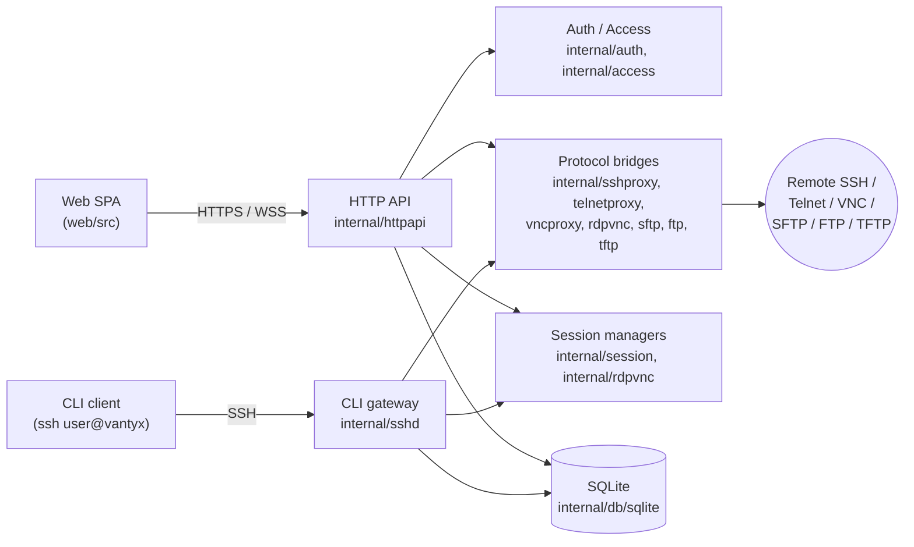

<p align="center">
  <picture>
    <source media="(prefers-color-scheme: dark)" srcset="web/public/logo-dark.svg">
    
  </picture>
</p>

# Vantyx

[日本語](README.ja.md)

[](https://github.com/nullpo7z/vantyx/actions/workflows/ci-dev.yml)
[](LICENSE)

Vantyx is a self-hosted access gateway that bridges browsers and CLI clients
to the SSH, Telnet, RDP, VNC, SFTP, FTP, and TFTP servers behind it. It ships
as a single container, terminates TLS itself, persists state in SQLite, and
exposes a unified REST + WebSocket API for the bundled single-page UI.

## Highlights

- **Browser terminal** for SSH and Telnet (xterm.js + WebSocket): session
  resume, NAWS, persistent shells, and SSH host-key TOFU with fingerprint
  adoption on the target record.
- **Collaborative terminal sessions** (SSH / Telnet): invite other users to
  the same session—one writer, read-only viewers, named or link invitations,
  write-token request/grant, and live UI sync over SSE. See
  [docs/collaborative-sessions.md](docs/collaborative-sessions.md).
- **Browser remote desktop**: VNC via noVNC; RDP targets use an
  xfreerdp + Xvfb + x11vnc chain in the browser. Multi-user VNC attach is on
  the [roadmap](docs/roadmap.md).
- **File transfer** for SFTP, FTP, remote TFTP, and a built-in TFTP server,
  plus background transfer jobs with progress SSE.
- **Credential library** (admin): separate **Keys** (private PEM only) and
  **Identities** (username + auth). Apply to targets via Identity, Key + manual
  username, or inline entry. See [docs/credentials.md](docs/credentials.md).
- **Hierarchical access groups** (`net/tokyo` inherits access from `net`) plus
  **tag-based access control** on groups, targets, and users. See
  [docs/access-control.md](docs/access-control.md).
- **OIDC single sign-on** (Keycloak, Entra ID, Okta, Cloudflare Access, … via
  discovery + PKCE) and **TOTP two-factor** for built-in users on the web UI.
  See [docs/configuration.md](docs/configuration.md#two-factor-authentication-totp).
- **CLI gateway**: `ssh user@vantyx` (public-key auth only) and proxy to
  allowed targets.
- **Session recording**: terminal/CLI sessions as asciinema `.cast`; RDP/VNC
  screen capture as H.264 `.mp4`. Playback in the UI; GIF/MP4 export via a
  background conversion queue.
- **Audit pipeline** with optional syslog / SIEM forwarding, and a
  Prometheus `/metrics` endpoint.
- Follows the spirit of **OWASP ASVS Level 2** (best-effort, not a formal audit)
  for sensitive-data storage and transport.

## Quickstart (Docker)

Published image: [`nullpo7z/vantyx:latest`](https://hub.docker.com/r/nullpo7z/vantyx)

```bash
# You only need two files — no clone required
mkdir -p vantyx && cd vantyx
curl -fsSLO https://raw.githubusercontent.com/nullpo7z/vantyx/main/docker-compose.yml
curl -fsSL  https://raw.githubusercontent.com/nullpo7z/vantyx/main/.env.example -o .env

# Edit .env: set VANTYX_EXTERNAL_HOST (browser hostname/IP) and
# VANTYX_SSH_PASSWORD_ENCRYPTION_KEY (from: openssl rand -base64 32)

# Create the state directories and point the compose file at them.
# The container runs as uid 65532 (nonroot), so it must own them.
sudo mkdir -p /opt/vantyx/{certs,data,recordings}
sudo chown -R 65532:65532 /opt/vantyx
sed -i 's#/path/to/vantyx#/opt/vantyx#g' docker-compose.yml

docker compose pull    # fetch nullpo7z/vantyx:latest (no local build)
docker compose up -d   # uses docker-compose.yml (operations)
```

Open `https://<VANTYX_EXTERNAL_HOST>/` in your browser (you may need to accept
the self-signed TLS warning on first start).

Cloning the repository is only needed for development. To build the image from
source, clone it and use [docker-compose.dev.yml](docker-compose.dev.yml):

```bash
git clone https://github.com/nullpo7z/vantyx.git && cd vantyx
cp .env.example .env    # then edit it as above
docker compose -f docker-compose.dev.yml up --build -d
```

| Port     | Purpose                                                                                        |
|----------|------------------------------------------------------------------------------------------------|
| `80`     | Always 301-redirects to HTTPS (cannot be disabled).                                            |
| `443`    | The application (REST API + SPA). Inside the container the listeners bind to `8080` / `8443`. |
| `2222`   | CLI SSH gateway (`ssh -p 2222 admin@<host>`; public-key auth only, register keys under Users → Public keys) |
| `69/udp` | Forwarded to the embedded TFTP server (`6969/udp` inside the container).                       |

- **TLS**: a self-signed certificate is created on first start under
  `/path/to/vantyx/certs`. For production, mount your own cert via
  `VANTYX_TLS_CERT_FILE` / `VANTYX_TLS_KEY_FILE`, or set `VANTYX_TLS_SANS` and
  remove `certs` to regenerate.
- **Initial admin**: username `admin`. If `VANTYX_INITIAL_ADMIN_PASSWORD` is unset, a random
  password is printed once to the container logs on first start; you must change it on first
  login. Set `VANTYX_INITIAL_ADMIN_PASSWORD` in `.env` to choose your own before first boot.
- **Data persistence**: host paths `/path/to/vantyx/data` (SQLite) and
  `/path/to/vantyx/recordings`. Create the directories and edit the paths in
  `docker-compose.yml` before `docker compose up`.

| Compose file | Purpose |
|--------------|---------|
| [docker-compose.yml](docker-compose.yml) | **Operations** — pull `nullpo7z/vantyx:latest` (no `build`) |
| [docker-compose.dev.yml](docker-compose.dev.yml) | **Development** — `docker compose … up --build` from the repo |

## Architecture



A deeper dive lives in [docs/ARCHITECTURE.md](docs/ARCHITECTURE.md). The
public REST + WebSocket surface is documented in
[docs/api/openapi.yaml](docs/api/openapi.yaml) and served from `/docs`
(Swagger UI) for administrators.

## Configuration

All runtime knobs live under the `VANTYX_*` namespace. See
[docs/configuration.md](docs/configuration.md) for the full reference.

The minimum you need to set in production:

- `VANTYX_EXTERNAL_HOST` or `VANTYX_ALLOWED_HOSTS` — required for safe
  HTTP→HTTPS redirects.
- `VANTYX_SSH_PASSWORD_ENCRYPTION_KEY` — required when operators may store
  SSH passwords on target records (AES-256-GCM at rest, OWASP ASVS V7.12).

```bash
# Generate a 32-byte key, Base64-encoded
openssl rand -base64 32
```

Rotating this key makes previously-encrypted passwords undecryptable. Store
the key in your secret manager (Kubernetes Secret, AWS Secrets Manager, …).

## Local development

See [docs/development.md](docs/development.md) for the full guide.

```bash
# Backend
VANTYX_EXTERNAL_HOST=localhost \
  VANTYX_TLS_CERT_FILE=./certs/tls.crt \
  VANTYX_TLS_KEY_FILE=./certs/tls.key \
  go run ./cmd/vantyx-server

# Frontend
cd web && npm install && npm run dev
```

Lint, test, and coverage:

```bash
make fmt    # gofmt + goimports + eslint --fix
make lint   # golangci-lint + eslint
make test   # go test ./... + go vet ./...
```

## Security

Vantyx tries to follow the spirit of
[OWASP ASVS Level 2](docs/SECURITY-ASVS-L2.md) for sensitive data at rest
and in transit (best-effort, not a formal audit). See
[SECURITY.md](SECURITY.md) before reporting vulnerabilities — please use
the GitHub private security advisory form rather than opening a public
issue.

## Contributing

Bug reports, code, docs, and translations are all welcome. See
[CONTRIBUTING.md](CONTRIBUTING.md) for the short rundown; changes are tracked
in [CHANGELOG.md](CHANGELOG.md).

## License

Vantyx is released under the [Apache License 2.0](LICENSE). Third-party
attribution lives in [NOTICE](NOTICE), which covers the Go modules linked into
the binary, the JavaScript compiled into the web assets (noVNC is MPL-2.0), and
the Alpine packages shipped in the container image (x11vnc, tigervnc and ffmpeg
are GPL; Vantyx runs them as separate processes and does not link against them).

A running server serves the full licence texts of the bundled JavaScript at
`/THIRD-PARTY-LICENSES.txt`; the same file is in the image at
`/app/web/dist/THIRD-PARTY-LICENSES.txt`, alongside `/app/LICENSE` and
`/app/NOTICE`.
