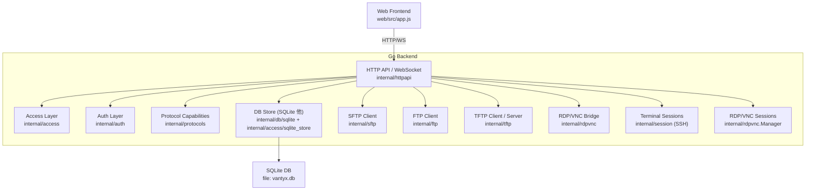
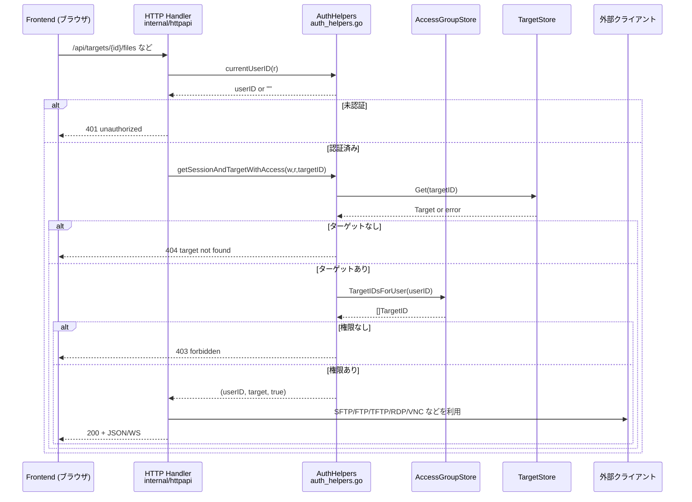

# Vantyx アーキテクチャ概要

[English](ARCHITECTURE.md)

このドキュメントは、現在のバックエンド構成と主要コンポーネントの関係を簡潔に示します。

### 全体構成（フロントエンド〜バックエンド〜DB）



### HTTP API 層の構成（認証・認可と機能モジュール）

```mermaid
graph TD
    subgraph HTTPAPI["internal/httpapi"]
        Router["router.go<br/>HTTPルーティング"] --> Handlers

        Handlers["Handlers<br/>groups / targets / files / tftp_server / terminal / rdp / vnc / recordings ..."]

        AuthHelpers["auth_helpers.go<br/>currentUserID / requireAdmin / requireTargetAccess / getSessionAndTargetWithAccess"]
        ProtocolCaps["protocols.Supports*<br/>CapabilityTerminal / FileTransfer / TFTPServer"]

        Handlers --> AuthHelpers
        Handlers --> ProtocolCaps

        %% ファイル転送
        Handlers --> Files["files.go<br/>SFTP/FTP/TFTP クライアント統合"]
        Handlers --> TFTPFiles["tftp_server_files.go<br/>組み込みTFTPサーバーのファイル操作"]
        Files --> SFTPClient["internal/sftp.Client"]
        Files --> FTPClient["internal/ftp.Client"]
        Files --> TFTPClient["internal/tftp.Client"]

        %% ターミナル / RDP / VNC
        Handlers --> TermWS["terminal.go<br/>/ws/ssh + TerminalSessionManager"]
        Handlers --> RDPWS["rdp.go<br/>/ws/rdp + /api/rdp/sessions"]
        Handlers --> VNCWS["vnc.go<br/>/ws/vnc + /api/vnc/sessions"]

        TermWS --> TermSessMan["TerminalSessionManager<br/>internal/session"]
        RDPWS --> RDPVNCMan["RDPVNCManager<br/>internal/rdpvnc"]
        VNCWS --> RDPVNCMan

        %% ストア
        Handlers --> TargetStore["TargetStore<br/>internal/access.TargetStore"]
        Handlers --> GroupStore["AccessGroupStore<br/>internal/access.AccessGroupStore"]
        Handlers --> UserStore["UserStore<br/>internal/auth.UserStore"]
        Handlers --> SessionStore["SessionStore<br/>internal/auth.SessionStore"]
    end

    TargetStore --> AccessSQLite["sqlite_store.go"]
    GroupStore  --> AccessSQLite
    UserStore   --> AuthSQLite["auth用のDB実装"]
    SessionStore --> AuthSQLite
```



### プロトコルと機能対応（`internal/protocols`）

```mermaid
graph TD
    subgraph Protocols["internal/protocols.Capability"]
        SSH["access.ProtocolSSH"] --> Term["CapabilityTerminal"]
        SSH --> FileXfer["CapabilityFileTransfer"]

        Telnet["access.ProtocolTelnet"] --> Term

        RDP["access.ProtocolRDP"] --> Term
        VNC["access.ProtocolVNC"] --> Term

        FTPP["access.ProtocolFTP"] --> FileXfer

        TFTPP["access.ProtocolTFTP"] --> FileXfer
        TFTPP --> TFTPServ["CapabilityTFTPServer"]
    end

    HTTPHandlers["HTTP Handlers"] -->|Supports(p, cap)| Protocols
```

### ファイル転送レイヤ（SFTP / FTP / TFTP）

- **抽象インターフェース**
  - `internal/httpapi/sftp_iface.go`
    - `FileTransferFile`:
      - `Read` / `Close` / `Stat()` を持つ最小限のファイルインターフェース。
    - `FileTransferClient`:
      - `ReadDir(path)` / `Open(path)` / `Create(path)` / `RemoveAll(path)` を持つ「プロトコル非依存のファイル転送クライアント」。
    - `SFTPClientFactoryFunc`:
      - テストなどで SFTP クライアント生成処理を差し替えるためのファクトリ。
- **各プロトコルのアダプタ**
  - `internal/httpapi/files.go`
    - `sftpClientAdapter`（`*sftp.Client` → `FileTransferClient`）
    - `ftpClientAdapter`（`*ftp.Client` → `FileTransferClient`）
  - `internal/httpapi/files_tftp.go`
    - `tftpClientAdapter`（`*tftp.Client` → `FileTransferClient`）
    - TFTP の制約（ディレクトリ一覧なし・削除不可など）を内部で吸収。
- **HTTP ハンドラとの関係**
  - `internal/httpapi/files.go` の `getTargetAndFileClient`:
    - 認証・認可 → `getSessionAndTargetWithAccess`（`auth_helpers.go`）
    - プロトコル能力チェック → `protocols.SupportsFileTransfer`
    - プロトコルごとに適切なクライアントを生成し、`FileTransferClient` として返却。
  - ファイル転送系ハンドラ（list/download/upload/delete）は、`FileTransferClient` のみを相手に実装されており、SFTP/FTP/TFTP の差異はアダプタ層に閉じ込められている。
- **バックグラウンド転送（画面離脱後も継続）**
  - `internal/filetransfer`: プロセス内で転送ジョブ（`receiving` → `running` → `completed` 等）を管理。再起動でジョブは消失。
  - `internal/httpapi/file_transfers.go`: `POST /api/file-transfers/upload|download`、`GET/DELETE /api/file-transfers/{id}`、`GET .../content`（完了 DL の取得）。
  - `web/src/file_transfer_manager.js`: グローバル下部バーとポーリング。`web/src/sessions_page.js` の「セッション」一覧でも進捗・中止を表示。

### フロントエンド UI 構成（ナビゲーションとページ切り替え）

- **エントリポイント**
  - `web/src/app.js`
    - `renderApp(container)` がヘッダーナビゲーション・メインコンテンツ領域・各種モーダル用の空コンテナを描画し、その後のイベントバインドと画面切り替えを担当。
- **ナビゲーションの状態管理**
  - ナビゲーション要素: `navTargets`（ホーム） / `navRecordings`（録画） / `navGroups`（サーバー管理） / `navUsers`（ユーザー管理）。
  - 共通クラス定数:
    - `NAV_BASE`: 非アクティブ時のベースクラス。
    - `NAV_ACTIVE`: アクティブタブのクラス（太字＋下線）。
  - `setActiveNav(tab)`:
    - `meData.role` を見て admin のときだけ「サーバー管理 / ユーザー管理」を表示。
    - 引数 `tab` に `targets / groups / users / recordings` を渡すことで、どのタブをアクティブ表示にするかを統一的に制御。
- **ページレンダリング関数との連携**
  - 例:
    - `showUserInfo()` → `setActiveNav('recordings')`（ユーザー情報は録画タブと同じコンテキストで扱う）。
    - `showUsersPage()` → `setActiveNav('users')`。
  - 今後新しいタブやページを追加する場合は、`setActiveNav` の呼び出しのみでナビの見た目と role ベースの表示制御を揃えられる。

### ログと監査（バックエンド）

- **HTTP 共通アクセスログ**
  - `internal/httpapi/router.go` のラッパミドルウェアが、すべての HTTP リクエストについて
    - `method` / `path` / `status` / `remote` / `duration`
    を `log.Printf("http method=%s path=%s status=%d remote=%s duration=%s", ...)` 形式で出力。
- **ドメイン別イベントログ**
  - ターミナル / RDP / VNC / ファイル転送 / 録画など、ユーザー操作に紐づくイベントは
    - `user_id` / `target_id` / `session_id` / `protocol` / `err` などのキーを用いた構造化に近いログ形式で出力。
  - 例:
    - 端末セッション開始: `terminal session start session_id=%s user_id=%s target_id=%s host=%s port=%d`
    - RDP ブラウザ接続: `rdp browser start user_id=%s target_id=%s vnc_port=%d`
    - 録画変換失敗: `recording convert failed id=%s format=%s err=%v`
- **認可失敗・対象未存在のログ**
  - `auth_helpers.go` でターゲットの取得・アクセスチェックに失敗した場合:
    - ターゲット未存在: `target not_found user_id=%s target_id=%s`
    - アクセス拒否: `target access forbidden user_id=%s target_id=%s`
  - これにより、監査上重要な「誰がどのターゲットにアクセスしようとして拒否されたか」を一貫した形式で追跡できる。

### 認証・認可フロー（抜粋）



### 拡張の指針（プロトコル・機能追加）

- **新しいプロトコルを追加するとき**
  - `internal/access` に `ProtocolXXX` を追加する。
  - `internal/protocols/capabilities.go` の `Supports` に、そのプロトコルがサポートする機能（ターミナル / ファイル転送 / TFTP サーバーなど）を追記する。
  - `internal/httpapi/router.go` の `parseProtocolField` に文字列表現（例: `"myproto"`）と `access.ProtocolXXX` のマッピングを追加する。
  - 必要に応じて、`internal/sftp` / `internal/ftp` / `internal/tftp` / `internal/rdpvnc` と同様のクライアント・ブリッジを新設し、`internal/httpapi` 側のハンドラから呼び出す。

- **新しい HTTP 機能（エンドポイント）を追加するとき**
  - 認証・認可は **必ず `auth_helpers.go`** 経由で行う。
    - 管理者専用   → `requireAdmin`
    - グループ単位 → `requireGroupMemberOrAdmin`
    - ターゲット単位 → `getSessionAndTargetWithAccess` / `requireTargetAccess`
  - プロトコル能力による制御が必要な場合は `internal/protocols` の `Supports` / `SupportsFileTransfer` を利用し、`if target.Protocol == ...` の分岐を分散させない。

- **フロントエンドからの利用**
  - サーバー管理やファイル転送 UI では、バックエンドの API スキーマ（`docs/api/openapi.yaml`）と、このアーキテクチャ図を見ながら、
    - どのエンドポイントで
    - どのプロトコルが
    - どの機能（ターミナル / ファイル転送 / TFTP サーバーなど）を提供しているか
    を対応づけて画面を実装する。


