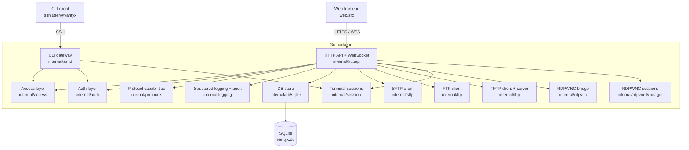
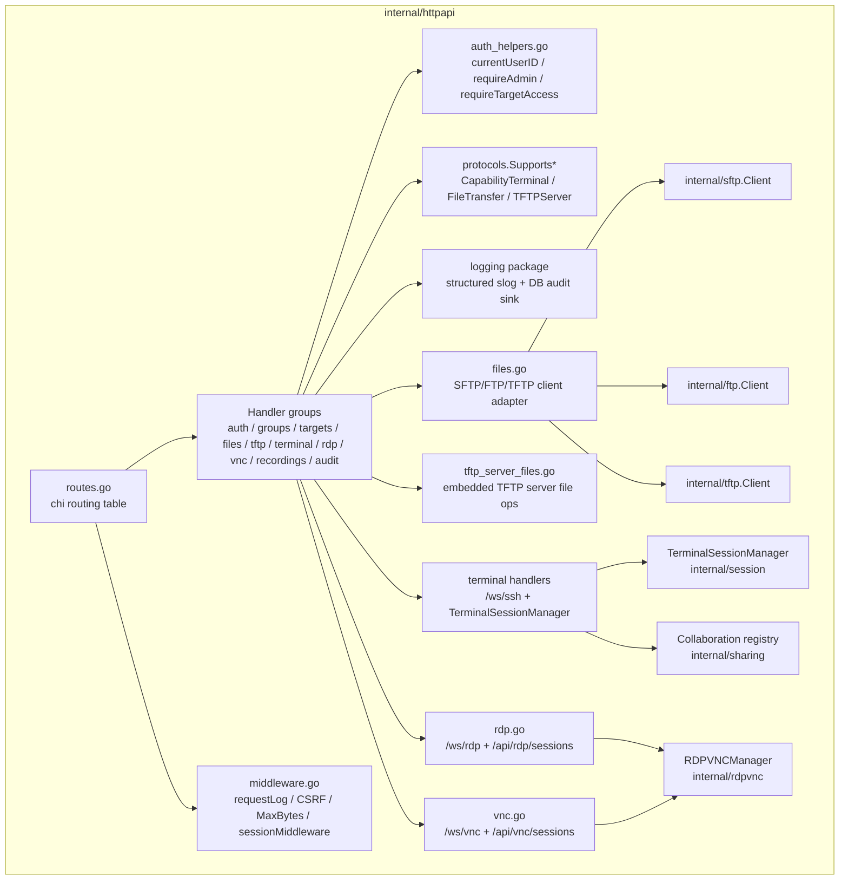
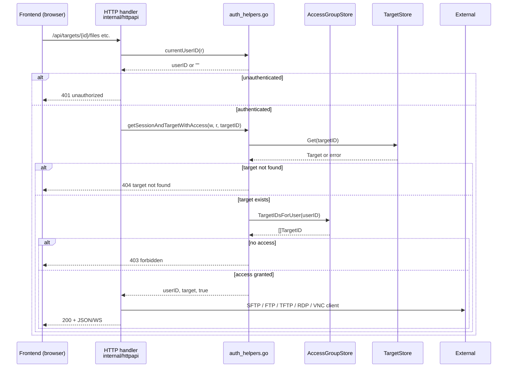

# Vantyx architecture

This document gives a high-level tour of the Vantyx backend, the SPA, and
how they cooperate. It is aimed at new contributors who need to find their
way around the source tree before making a change.

## Full stack overview



## Entry points

| Binary | Source | Purpose |
|--------|--------|---------|
| `vantyx-server` | [`cmd/vantyx-server`](../cmd/vantyx-server) | Boots HTTP/HTTPS listeners, optional CLI SSH gateway, embedded TFTP server, and TLS bootstrap. |

The server constructs the HTTP application via `httpapi.NewApp()`,
optionally creates a `sshd.Server`, then starts both listeners and waits
for SIGINT / SIGTERM.

## HTTP layer



### Collaborative terminal sessions

User-facing guide: [collaborative-sessions.md](collaborative-sessions.md).

Terminal sessions can have multiple attached clients. Exactly one
client holds the *write token* and may forward keystrokes to the
target; the others attach as read-only viewers and the bridge drops
their stdin server-side.

The detachable bridges in
[`internal/sshproxy/bridge_detachable.go`](../internal/sshproxy/bridge_detachable.go)
and
[`internal/telnetproxy/bridge_detachable.go`](../internal/telnetproxy/bridge_detachable.go)
keep an internal map of clients, fan target output out to every one
of them, and expose a `BridgeController.SetWriter(userID)` hook
that the HTTP layer uses to switch the writer at runtime without
disconnecting anyone.

Room state (owner, current writer, participants, pending control
requests) lives in [`internal/sharing.Registry`](../internal/sharing).
Persisted invitations live in the `session_invitations` table and
are accessed through `sharing.Store`. Tokens are stored as SHA-256
hashes only; the plain token is returned exactly once at creation
time.

The HTTP surface adds:

| Method & path | Purpose |
|---|---|
| `POST /api/terminal/sessions/{id}/invitations` | Owner issues a named or link invitation |
| `GET /api/terminal/sessions/{id}/invitations` | List own session's invitations |
| `DELETE /api/terminal/sessions/{id}/invitations/{inv_id}` | Revoke an invitation |
| `POST /api/terminal/sessions/{id}/join` | Consume an invitation and join as viewer |
| `GET /api/terminal/sessions/{id}/participants` | Participants + pending write requests |
| `DELETE /api/terminal/sessions/{id}/participants/{user_id}` | Owner kicks a participant |
| `POST /api/terminal/sessions/{id}/write-requests` | Viewer requests control |
| `POST /api/terminal/sessions/{id}/write-requests/{req_id}/grant` | Writer grants control |
| `POST /api/terminal/sessions/{id}/write-requests/{req_id}/deny` | Writer denies control |
| `POST /api/terminal/sessions/{id}/write-token/release` | Writer voluntarily releases control |

`/ws/ssh?session_id=...&mode=writer|viewer` is the WebSocket attach;
viewers also pass `&invite=<plain-token>` on first attach so the
backend consumes the invitation atomically. SSE events
(`participant_joined`, `participant_left`,
`write_request_pending`, `write_request_decided`,
`write_token_transferred`, `invitation_revoked`,
`invitation_consumed`) keep every
participant's UI in sync without polling.

### SSH host key verification (TOFU)

[`internal/sshproxy/hostkey.go`](../internal/sshproxy/hostkey.go) holds
all host key policy. The bridge's `BridgeOption` set is built from the
target row at connect time:

- `WithHostKeyFingerprint(target.SSHHostKeyFingerprint)` enforces a
  constant-time SHA-256 match against the offered key.
- `WithInsecureSkipHostKeyVerify()` is honoured only when
  `VANTYX_SSH_INSECURE_IGNORE_HOST_KEY=1` is set in the environment.
- `WithCapturedFingerprint(*string)` makes the host key callback
  publish the offered fingerprint into a caller-supplied buffer; this
  is what the probing endpoint uses to retrieve a fingerprint without
  persisting anything.

When verification fails, the callback returns either
`*HostKeyUnknownError` (no fingerprint configured) or
`*HostKeyMismatchError` (fingerprint does not match). The HTTP layer
detects these in
[`internal/httpapi/terminal_hostkey_frame.go`](../internal/httpapi/terminal_hostkey_frame.go)
and emits a structured WebSocket frame
(`{"type":"host_key_unknown"|"host_key_mismatch", ...}`) instead of
the legacy `error: ...` text frame, so the SPA can render a TOFU
adoption / mismatch dialog and call `PUT
/api/targets/{id}/ssh-host-key` once the operator approves. Two
companion endpoints support this flow:

| Method & path | Purpose |
|---|---|
| `POST /api/targets/probe-host-key` | Admin-only one-shot dial that returns the offered SHA-256 fingerprint |
| `PUT /api/targets/{id}/ssh-host-key` | Admin-only adopt (`{"fingerprint":"SHA256:..."}`) or clear (`{"fingerprint":""}`) |

Both endpoints emit dedicated audit events
(`target_host_key_probed`, `target_host_key_probe_failed`,
`target_host_key_adopted`, `target_host_key_cleared`,
`terminal_host_key_unknown_presented`,
`terminal_host_key_mismatch_presented`) so retrospective review can
trace every key adoption back to the operator that approved it.

Cross-cutting concerns live in shared files:

- [`middleware.go`](../internal/httpapi/middleware.go) — request logging,
  CSRF origin check, max body bytes, session cookie verification, panic
  recovery.
- [`auth_helpers.go`](../internal/httpapi/auth_helpers.go) — current user
  resolution, role checks, and the central `getSessionAndTargetWithAccess`
  helper used by every target-scoped handler.
- [`protocol_helpers.go`](../internal/httpapi/protocol_helpers.go) — maps
  string protocol identifiers (`ssh`, `telnet`, `rdp`, `vnc`, `sftp`,
  `ftp`, `tftp`) to `access.Protocol` constants used throughout the
  backend.

## Protocols and capabilities

```mermaid
graph TD
    subgraph Protocols["internal/protocols.Capability"]
        SSH["access.ProtocolSSH"] --> Term["CapabilityTerminal"]
        SSH --> FileXfer["CapabilityFileTransfer"]

        Telnet["access.ProtocolTelnet"] --> Term

        RDP["access.ProtocolRDP"] --> Term
        VNC["access.ProtocolVNC"] --> Term

        FTPP["access.ProtocolFTP"] --> FileXfer

        TFTPP["access.ProtocolTFTP"] --> FileXfer
        TFTPP --> TFTPServ["CapabilityTFTPServer"]
    end

    HTTPHandlers["HTTP handlers"] -->|Supports(p, cap)| Protocols
```

New protocols should add a `ProtocolXxx` constant in `internal/access` and
extend `internal/protocols/capabilities.go::Supports`. Handlers should
branch on capability, not protocol literals, so adding a new bridge does
not require touching every handler.

## File transfer layer

- **Abstract interfaces** (`internal/httpapi/sftp_iface.go`):
  - `FileTransferFile` — minimal file abstraction (`Read`, `Close`,
    `Stat`).
  - `FileTransferClient` — protocol-agnostic operations (`ReadDir`,
    `Open`, `Create`, `RemoveAll`).
  - `SFTPClientFactoryFunc` — injection seam used by tests to swap real
    SSH dials for mocks.
- **Adapters**:
  - `files.go` — `sftpClientAdapter` and `ftpClientAdapter`.
  - `files_tftp.go` — `tftpClientAdapter` (handles TFTP's lack of
    listing / delete by returning sentinel errors).
- **Handler entry point**: `getTargetAndFileClient` authenticates,
  authorises (via `auth_helpers.go`), checks
  `protocols.SupportsFileTransfer`, then returns a ready-to-use
  `FileTransferClient`. The list / download / upload / delete handlers
  only know about the interface.
- **Background transfers**: `internal/filetransfer` runs upload /
  download jobs that survive the page leaving the file UI. Phases:
  `receiving → running → completed | failed`. Jobs persist in SQLite
  (`file_transfer_jobs`). The SPA uses SSE (`/api/events/file-transfers`)
  with polling fallback via `web/src/file_transfer_manager.js`.

## Frontend (SPA)

- Entry point: [`web/src/app.js`](../web/src/app.js) calls `renderApp`,
  which wires the header, nav, and main content container, then
  delegates each view to a dedicated module under `web/src/`.
- Pages live in dedicated files under `web/src/`: targets, sessions,
  recordings, audit, settings, users, **credentials** (Keys / Identities in
  [`credentials_page.js`](../web/src/credentials_page.js)),
  terminal, RDP, VNC, files, TFTP console, account.
- Shared helpers: [`api.js`](../web/src/api.js) (typed wrappers around
  REST endpoints), [`nav.js`](../web/src/nav.js) (active tab state +
  role-based visibility), [`theme.js`](../web/src/theme.js) (dark / light
  toggle), [`file_transfer_manager.js`](../web/src/file_transfer_manager.js)
  (global bottom progress bar + polling).

## Logging and auditing

- [`internal/logging`](../internal/logging) wraps `log/slog` and provides
  `Default()`, `WithComponent(name)`, and `Audit(ctx, event, attrs...)`.
- HTTP access logs and domain events use the same handler, so log
  destinations stay in one place.
- Audit events are written to a bounded in-memory ring for the audit UI,
  and persisted by `internal/httpapi/audit_sink.go` to the DB + an
  optional file. From there, the optional forwarder
  (`internal/httpapi/audit_forwarder.go`) can ship them to a syslog or
  HTTP SIEM endpoint.

Key naming convention (documented in
[development.md](development.md#logging-keys)) keeps queries grep-friendly:
`user_id`, `target_id`, `session_id`, `protocol`, `error`, `duration_ms`,
`remote`, `method`, `path`, `status`, `event`.

## Stored SSH credentials (Keys / Identities)

Administrators maintain a split Keys / Identities credential library separate from
per-target copies:

| Store | Package / table | HTTP API |
|-------|-----------------|----------|
| Keys (private PEM) | `internal/access` → `ssh_keys` | `GET/POST/PUT/DELETE /api/ssh-keys` |
| Identities (username + auth) | `credential_identities` | `GET/POST/PUT/DELETE /api/credential-identities` |

`httpapi.applyStoredCredentials` copies library secrets into target create/update
payloads when `credential_identity_id` or `ssh_key_id` is set. Secrets are
encrypted with the same `VANTYX_SSH_PASSWORD_ENCRYPTION_KEY` used for target rows.

Full workflow and UI modes are documented in [credentials.md](credentials.md).

**Do not confuse** `/api/ssh-keys` (stored **private** keys for targets) with
`/api/me/ssh-keys` (user **public** keys for the CLI gateway).

## Auth and access flow



## Extending Vantyx

### Add a new bridge protocol

1. Define a `ProtocolXxx` constant in `internal/access`.
2. Declare the capabilities it provides in
   `internal/protocols/capabilities.go::Supports`.
3. Register the string form in `internal/httpapi/protocol_helpers.go`
   (`parseProtocolField`).
4. Add the proxy / client package next to its siblings (for example
   `internal/sshproxy`, `internal/telnetproxy`, `internal/rdpvnc`).
5. Wire the new handler(s) in `internal/httpapi/routes.go` and reuse
   `auth_helpers.go` for authentication and authorisation.

### Add a new HTTP endpoint

- Always go through `auth_helpers.go`:
  - admin only — `requireAdmin`
  - group-scoped — `requireGroupMemberOrAdmin`
  - target-scoped — `getSessionAndTargetWithAccess` / `requireTargetAccess`
- Branch on `protocols.Supports*` rather than hard-coding `if target.Protocol == ...`.
- Emit `audit("event_name", auditFields{...})` so the operation appears
  in the audit log UI and gets persisted.

### Frontend additions

- Reference the API contract in
  [`docs/api/openapi.yaml`](api/openapi.yaml).
- Share constants with the backend via `web/src/constants.js` to avoid
  drift (for example the `tftp_enabled` capability tag).
- Add the new view as a dedicated file under `web/src`, register a
  route in `web/src/router.js`, and call `setActiveNav(...)` to keep
  navigation state in sync with role-based visibility.
