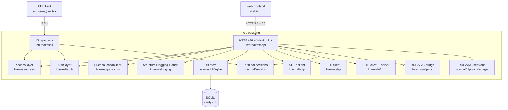
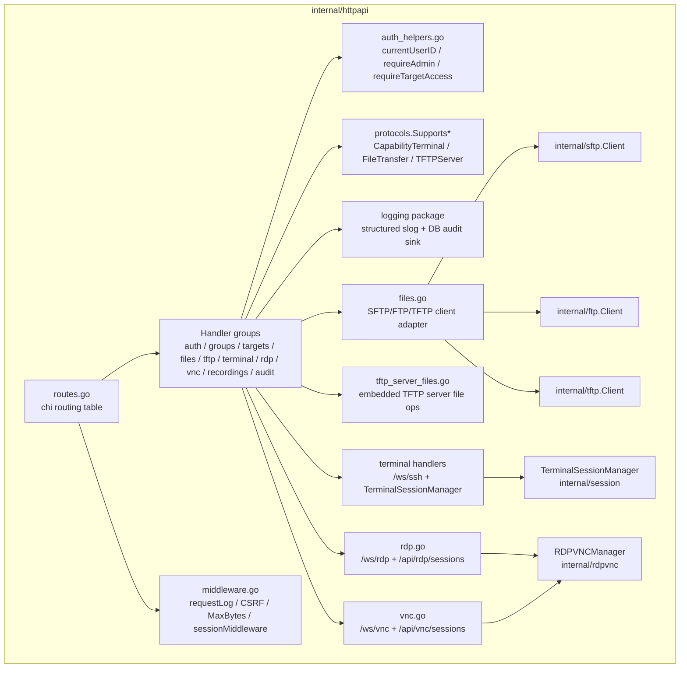
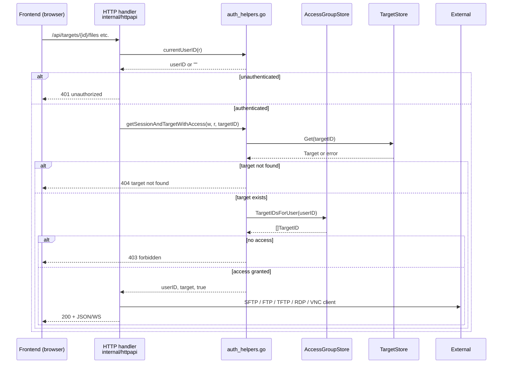

# Vantyx architecture

[日本語](ARCHITECTURE.ja.md)

This document gives a high-level tour of the Vantyx backend, the SPA, and
how they cooperate. It is aimed at new contributors who need to find their
way around the source tree before making a change.

## End-to-end stack



## Entry points

| Binary | Source | Purpose |
|--------|--------|---------|
| `vantyx-server` | [`cmd/vantyx-server`](../cmd/vantyx-server) | Boots HTTP/HTTPS listeners, optional CLI SSH gateway, embedded TFTP server, and TLS bootstrap. |

The server constructs the HTTP application via `httpapi.NewApp()`,
optionally creates a `sshd.Server`, then starts both listeners and waits
for SIGINT / SIGTERM.

## HTTP layer



Cross-cutting concerns live in shared files:

- [`middleware.go`](../internal/httpapi/middleware.go) — request logging,
  CSRF origin check, max body bytes, session cookie verification, panic
  recovery.
- [`auth_helpers.go`](../internal/httpapi/auth_helpers.go) — current user
  resolution, role checks, and the central `getSessionAndTargetWithAccess`
  helper used by every target-scoped handler.
- [`protocol_helpers.go`](../internal/httpapi/protocol_helpers.go) — maps
  string protocol identifiers (`ssh`, `telnet`, `rdp`, `vnc`, `sftp`,
  `ftp`, `tftp`) to `access.Protocol` constants used throughout the
  backend.

## Protocols and capabilities

```mermaid
graph TD
    subgraph Protocols["internal/protocols.Capability"]
        SSH["access.ProtocolSSH"] --> Term["CapabilityTerminal"]
        SSH --> FileXfer["CapabilityFileTransfer"]

        Telnet["access.ProtocolTelnet"] --> Term

        RDP["access.ProtocolRDP"] --> Term
        VNC["access.ProtocolVNC"] --> Term

        FTPP["access.ProtocolFTP"] --> FileXfer

        TFTPP["access.ProtocolTFTP"] --> FileXfer
        TFTPP --> TFTPServ["CapabilityTFTPServer"]
    end

    HTTPHandlers["HTTP handlers"] -->|Supports(p, cap)| Protocols
```

New protocols should add a `ProtocolXxx` constant in `internal/access` and
extend `internal/protocols/capabilities.go::Supports`. Handlers should
branch on capability, not protocol literals, so adding a new bridge does
not require touching every handler.

## File transfer layer

- **Abstract interfaces** (`internal/httpapi/sftp_iface.go`):
  - `FileTransferFile` — minimal file abstraction (`Read`, `Close`,
    `Stat`).
  - `FileTransferClient` — protocol-agnostic operations (`ReadDir`,
    `Open`, `Create`, `RemoveAll`).
  - `SFTPClientFactoryFunc` — injection seam used by tests to swap real
    SSH dials for mocks.
- **Adapters**:
  - `files.go` — `sftpClientAdapter` and `ftpClientAdapter`.
  - `files_tftp.go` — `tftpClientAdapter` (handles TFTP's lack of
    listing / delete by returning sentinel errors).
- **Handler entry point**: `getTargetAndFileClient` authenticates,
  authorises (via `auth_helpers.go`), checks
  `protocols.SupportsFileTransfer`, then returns a ready-to-use
  `FileTransferClient`. The list / download / upload / delete handlers
  only know about the interface.
- **Background transfers**: `internal/filetransfer` runs upload /
  download jobs that survive the page leaving the file UI. Phases:
  `receiving → running → completed | failed`. Jobs are stored in memory
  and lost on restart. The SPA polls and renders progress via
  `web/src/file_transfer_manager.js`.

## Frontend (SPA)

- Entry point: [`web/src/app.js`](../web/src/app.js) calls `renderApp`,
  which wires the header, nav, and main content container, then
  delegates each route to a `pages/` module.
- Pages live in dedicated files under `web/src`: targets, sessions,
  recordings, audit, settings, users, terminal, RDP, VNC, files,
  TFTP console, account.
- Shared helpers: [`api.js`](../web/src/api.js) (typed wrappers around
  REST endpoints), [`nav.js`](../web/src/nav.js) (active tab state +
  role-based visibility), [`theme.js`](../web/src/theme.js) (dark / light
  toggle), [`file_transfer_manager.js`](../web/src/file_transfer_manager.js)
  (global bottom progress bar + polling).

## Logging and auditing

- [`internal/logging`](../internal/logging) wraps `log/slog` and provides
  `Default()`, `WithComponent(name)`, and `Audit(ctx, event, attrs...)`.
- HTTP access logs and domain events use the same handler, so log
  destinations stay in one place.
- Audit events are written to a bounded in-memory ring for the audit UI,
  and persisted by `internal/httpapi/audit_sink.go` to the DB + an
  optional file. From there, the optional forwarder
  (`internal/httpapi/audit_forwarder.go`) can ship them to a syslog or
  HTTP SIEM endpoint.

Key naming convention (documented in
[development.md](development.md#logging-keys)) keeps queries grep-friendly:
`user_id`, `target_id`, `session_id`, `protocol`, `error`, `duration_ms`,
`remote`, `method`, `path`, `status`, `event`.

## Auth and access flow



## Extending Vantyx

### Add a new bridge protocol

1. Define a `ProtocolXxx` constant in `internal/access`.
2. Declare the capabilities it provides in
   `internal/protocols/capabilities.go::Supports`.
3. Register the string form in `internal/httpapi/protocol_helpers.go`
   (`parseProtocolField`).
4. Add the proxy / client package next to its siblings (for example
   `internal/sshproxy`, `internal/telnetproxy`, `internal/rdpvnc`).
5. Wire the new handler(s) in `internal/httpapi/routes.go` and reuse
   `auth_helpers.go` for authentication and authorisation.

### Add a new HTTP endpoint

- Always go through `auth_helpers.go`:
  - admin only — `requireAdmin`
  - group-scoped — `requireGroupMemberOrAdmin`
  - target-scoped — `getSessionAndTargetWithAccess` / `requireTargetAccess`
- Branch on `protocols.Supports*` rather than hard-coding `if target.Protocol == ...`.
- Emit `audit("event_name", auditFields{...})` so the operation appears
  in the audit log UI and gets persisted.

### Frontend additions

- Reference the API contract in
  [`docs/api/openapi.yaml`](api/openapi.yaml).
- Share constants with the backend via `web/src/constants.js` to avoid
  drift (for example the `tftp_enabled` capability tag).
- Add the new view as a dedicated file under `web/src`, register a
  route in `web/src/router.js`, and call `setActiveNav(...)` to keep
  navigation state in sync with role-based visibility.
