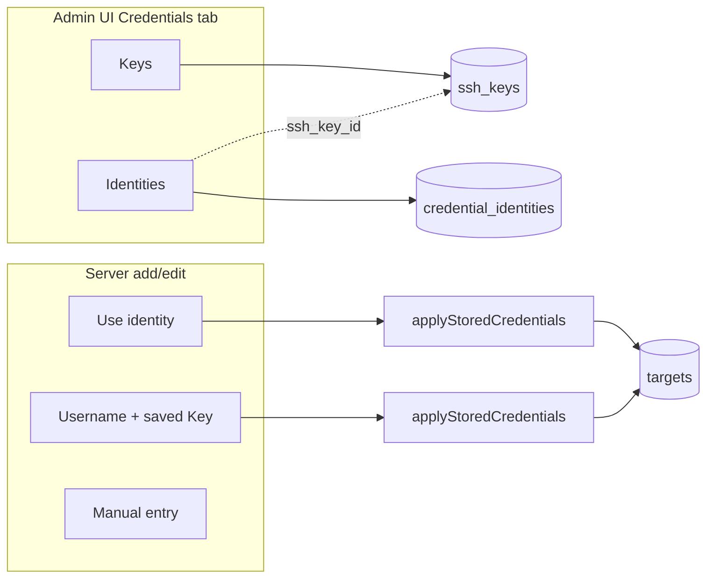

# Credentials (Keys and Identities)

Vantyx stores SSH login material in a **split Keys / Identities** model. Administrators manage a shared library; target records hold copies of the secrets needed to connect.

This is separate from **user SSH public keys** (`/api/me/ssh-keys`, `/api/users/{id}/ssh-keys`), which are only for authenticating to the Vantyx CLI gateway (`ssh user@vantyx`).

## Concepts

| Concept | Table | Purpose |
|---------|-------|---------|
| **Key** | `ssh_keys` | Label + SSH **private** key (PEM) and optional passphrase. No username. |
| **Identity** | `credential_identities` | Label + username + auth method: password, linked Key, or both. |
| **Target** | `targets` | Host connection row with its own copy of username / password / private key after apply. |

## Encryption at rest

Passwords, private keys, and passphrases in `ssh_keys`, `credential_identities`, and `targets` are encrypted with **AES-256-GCM** when `VANTYX_SSH_PASSWORD_ENCRYPTION_KEY` is set (same 32-byte Base64 key for all). See [configuration.md](configuration.md).

List/detail API responses never return secret values—only booleans such as `has_password`, `has_ssh_key`, and `key_type` (for Keys).

## Admin HTTP API

All routes require an **admin** session cookie unless noted.

| Method | Path | Description |
|--------|------|-------------|
| `GET` | `/api/ssh-keys` | List Keys (`key_type`, `has_passphrase`; no PEM). |
| `POST` | `/api/ssh-keys` | Create Key (`id`, `label`, `ssh_private_key`, optional `ssh_private_key_passphrase`). |
| `PUT` | `/api/ssh-keys/{key_id}` | Update label and/or rotate key material. |
| `DELETE` | `/api/ssh-keys/{key_id}` | Delete if not referenced by an Identity (`409` if in use). |
| `GET` | `/api/credential-identities` | List Identities (`auth_method`, `ssh_key_label`, presence flags). |
| `POST` | `/api/credential-identities` | Create Identity. |
| `PUT` | `/api/credential-identities/{identity_id}` | Update Identity. |
| `DELETE` | `/api/credential-identities/{identity_id}` | Delete Identity. |

`auth_method` on Identity list responses: `password`, `key`, or `password_and_key`.

If tables are missing (failed migration), list endpoints return **503** with a localized `credentials.notReady` message.

OpenAPI details: [api/openapi.yaml](api/openapi.yaml).

## Applying credentials to targets

On `POST /api/targets` or `PUT /api/targets/{id}`, the handler merges library secrets into the payload before save. Specify **at most one** of `credential_identity_id` or `ssh_key_id` (both together returns `400`).

1. `credential_identity_id` — username, password, and linked Key from the Identity.
2. `ssh_key_id` — private key (and passphrase) from the Key; **username must come from the request** (manual entry).
3. Otherwise — inline `ssh_username`, `ssh_password`, `ssh_private_key`, etc.

For create, non-empty request fields win over library values (`onlyIfEmpty`). For update, when a library ID is sent and no inline secret fields are sent, library values replace stored secrets.

### SPA modes (server add/edit)

| UI mode | API fields |
|---------|------------|
| Use an identity | `credential_identity_id` |
| Enter username + use a saved Key | `ssh_key_id` + `ssh_username` |
| Enter manually (not saved to library) | inline SSH fields only |

The **Credentials** nav page (`web/src/credentials_page.js`) manages Keys and Identities. Implementation: `internal/access/ssh_key_sqlite_store.go`, `credential_identity_sqlite_store.go`, `internal/httpapi/targets_handler.go` (`applyStoredCredentials`).

## Operational notes

- **Key type** (`RSA`, `ED25519`, `ECDSA`, …) is detected from PEM on create/update and stored in `ssh_keys.key_type`.
- Deleting a Key that is still linked from an Identity returns **409** (`sshKeys.inUse`).
- Rotating `VANTYX_SSH_PASSWORD_ENCRYPTION_KEY` makes existing ciphertext undecryptable; there is no re-wrap tool yet (see [SECURITY-ASVS-L2.md](SECURITY-ASVS-L2.md)).
