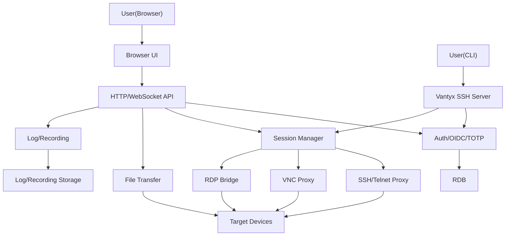

## Vantyx 実装計画

### 1. 全体アーキテクチャ方針

- **構成**
  - バックエンド: Go 1.26 のモノリシック API サーバー + WebSocket/TCP/SSH プロキシ
  - フロントエンド: シンプルな SPA もしくはサーバーレンダリング + Tailwind CSS v4 UI
  - 永続化: RDB（PostgreSQL 想定）+ オブジェクトストレージ or ローカルFS（セッション録画・ログ・ファイル転送用）
  - 配置: Docker コンテナで `backend` / `frontend` / `db` / `proxy(nginx等)` を分離
- **ディレクトリ例**
  - バックエンド: `[cmd/vantyx-server/main.go](cmd/vantyx-server/main.go)` / `[internal/ssh](internal/ssh)` / `[internal/vnc](internal/vnc)` / `[internal/rdp](internal/rdp)` / `[internal/auth](internal/auth)` / `[internal/session](internal/session)` / `[internal/audit](internal/audit)` など
  - フロントエンド: `[web/src](web/src)` / `[web/public](web/public)` / Tailwind 設定 `[web/tailwind.config.ts](web/tailwind.config.ts)`
  - インフラ: Docker 用 `[deploy/docker-compose.yml](deploy/docker-compose.yml)` / 将来の K8s 用 `[deploy/k8s](deploy/k8s)`

### 2. フェーズ分割と優先度

- **Phase 0: 基盤整備**
  - Go モジュール・ベースプロジェクト作成、ロギング・設定・DI の雛形を用意
  - Tailwind v4 のセットアップと UI フレーム（レイアウト・ナビゲーション）作成
  - Docker 環境（最小構成: backend + db + frontend）構築
- **Phase 1: 認証・認可のベースライン (SmartJumper 互換 + ローカルユーザー)**
  - ローカルユーザー管理とパスワード認証
  - 基本的なロール/権限モデル（ユーザー ↔ アクセスグループ ↔ ターゲット機器）
  - セッション管理（Cookie + Server-side セッション or JWT + DB セッションテーブル）
- **Phase 2: SSH/Telnet + セッション永続化 + CLIアクセス (中核機能)**
  - ブラウザターミナル (xterm.js)
  - **CLIアクセス (SmartJumper継承)**
    - Vantyx が SSH サーバーとして待受し、Tera Term 等のローカルクライアントから Vantyx に SSH ログイン
    - ログイン後、Vantyx 内の権限評価に基づきターゲット機器へ SSH/Telnet でプロキシ接続
    - CLI セッションもブラウザターミナルと同一のセッションマネージャ配下に置き、証跡ログ・録画・権限制御を共通化
  - Go バックエンドによる SSH/Telnet プロキシと PTY 管理
  - セッション永続化・レジューム・バックグラウンド実行
  - Asciinema 形式でのセッション録画
- **Phase 3: SmartJumper 互換機能の再実装**
  - 証跡ログ自動保存・検索 UI
  - 外部認証（Radius/Tacacs+/LDAP）連携
  - SSH 公開鍵・資格情報保存
  - SSL 証明書インポート
- **Phase 4: ファイル転送 (SFTP/TFTP) + ファイルマネージャー**
  - SFTP/TFTP プロトコル処理
  - Termius ライクなファイルマネージャー UI
- **Phase 5: VNC/RDP リモートデスクトップ**
  - noVNC 連携と VNC WebSocket プロキシ
  - RDP ブリッジ（FreeRDP ラップ or Go 実装）
- **Phase 6: OIDC + TOTP MFA + セキュリティ強化**
  - OIDC SSO 連携、TOTP による MFA
  - OWASP ASVS に基づくレビューと Harden

### 3. バックエンド詳細計画

#### 3.1 コア基盤

- **設定/ロギング/エラー処理**
  - Viper or envconfig などで `.env` / 環境変数から設定読込
  - zap/logrus 等で構造化ログ
  - 共通エラーラッパと HTTP レスポンス用エラーフォーマット
- **永続化レイヤ**
  - RDB 用のマイグレーションツール（golang-migrate など）導入
  - モデル例: `users`, `roles`, `targets`, `access_groups`, `sessions`, `cli_sessions`, `audit_logs`, `recordings`, `credentials`, `oidc_providers`
- **API サーバー**
  - HTTP ルータ（chi, echo, gin 等）選定
  - 認証ミドルウェア（セッション検証 / 権限チェック）実装

#### 3.2 認証・認可

- **ローカル認証 + セッション管理**
  - パスワードハッシュ (bcrypt/argon2)
  - CSRF 対策・Secure Cookie・SameSite 設定
- **アクセス制御モデル**
  - ユーザー ↔ グループ ↔ ターゲットの多対多リレーション
  - API/CLI 両方で同一ロジックによりアクセスチェック
- **外部認証 (SmartJumper 互換)**
  - Radius/Tacacs+/LDAP クライアントのラッパ
  - タイムアウト/リトライ/フォールバック戦略

#### 3.3 ターミナル接続 & セッション永続化 + CLIアクセス

- **SSH/Telnet プロキシ（ブラウザ経由）**
  - `gorilla/websocket` 等でブラウザとの WebSocket 確立
  - Go の `crypto/ssh` もしくは既存ライブラリで SSH セッション + PTY 開設
  - Telnet 用には生 TCP + 単純なネゴシエーション実装
- **CLIアクセスゲートウェイ (SmartJumper継承)**
  - Vantyx 自身が SSH サーバーとして LISTEN（例: `:22` or 任意ポート）
  - ユーザーは `ssh user@vantyx` としてログイン
  - 認証後、Vantyx 内のシェル風 UI あるいはメニューからターゲット選択
  - 選択されたターゲットへ、同一セッションマネージャ経由で SSH/Telnet 接続
  - CLI セッションも ID 付きで管理し、テキストログ・録画・権限チェックをブラウザセッションと同一パイプラインで処理
- **セッション永続化/レジューム共通基盤**
  - セッション管理コンポーネント `[internal/session/manager.go](internal/session/manager.go)` を設計
  - Goroutine 内に PTY + SSH セッションを保持し、クライアント(WebSocket or SSHチャネル)は attach/detach 可能とする
  - 出力リングバッファ（メモリ + 必要に応じてディスク）に stdout/stderr を保持し、再接続時に再送
- **Asciinema 録画**
  - 入出力イベントにタイムスタンプを付与し JSONL ファイルとして保存
  - メタデータ (`user_id`, `target_id`, `session_id`, `channel_type(browser/cli)`) を DB に保持

#### 3.4 VNC/RDP プロキシ

- **VNC (noVNC 連携)**
  - RFB プロトコルを TCP で受け取り、WebSocket にカプセル化してブラウザへ中継
  - 認証・権限制御を既存のセッション管理と統合
- **RDP ブリッジ**
  - 初期バージョンは FreeRDP CLI をラップし、標準入出力を WebSocket にブリッジする方式も検討
  - 後続で Go ネイティブ実装に置き換え可能なインターフェース設計

#### 3.5 ファイル転送 (SFTP/TFTP)

- **SFTP**
  - `golang.org/x/crypto/ssh` + SFTP ライブラリでターゲットへの SFTP チャネルを開設
  - API で `list/upload/download/delete` 操作を公開
- **TFTP**
  - シンプルな UDP ベースの TFTP クライアント/サーバーを実装 or 既存ライブラリ採用
  - コンフィグバックアップ/リストア用の高レベル API を用意

#### 3.6 OIDC + TOTP MFA

- **OIDC**
  - `coreos/go-oidc` を利用し、Authorization Code Flow + PKCE でログイン
  - IdP ごとのクライアント設定管理 (Keycloak/AzureAD 等)
- **TOTP**
  - `pquerna/otp` で TOTP 秘密鍵の生成・検証
  - QR コード発行（PNG/URI）と登録フロー

#### 3.7 IPv4/IPv6・リンクローカル対応

- `fe80::1%eth0` 形式の Zone ID を `net` パッケージでパース
- インターフェースインデックス解決ロジックをネットワークアクセス共通ユーティリティとして実装

### 4. フロントエンド詳細計画

#### 4.1 ベース UI

- Tailwind v4 セットアップと基本レイアウト
  - サイドバー + トップバー + メインコンテンツ構成
  - 共通コンポーネント: ボタン、フォーム、モーダル、トースト

#### 4.2 認証フロー UI

- ログイン画面（ユーザー名/パスワード + MFA コード入力）
- OIDC ログインボタンとリダイレクトハンドリング
- 認証後ダッシュボード（セッション一覧、最近のログなど）

#### 4.3 ターミナル UI (xterm.js)

- xterm.js のラッパコンポーネント実装
- WebSocket 接続管理（再接続・レジュームボタン）
- 画面サイズ変更・フォントサイズ・テーマ切替
- 録画メタ情報の表示と Asciinema 再生用ビュー

#### 4.4 ファイルマネージャー UI

- 左側にディレクトリツリー、右側にファイル一覧
- ドラッグ＆ドロップアップロード、コンテキストメニュー（ダウンロード/削除/リネーム）

#### 4.5 VNC/RDP ビューア

- noVNC の埋め込みコンポーネント
- 接続先選択・解像度変更・全画面表示

#### 4.6 ログ・証跡ビューア

- セッションログ検索フォーム（期間・ユーザー・ターゲット）
- 検索結果一覧 + 詳細ビュー
- Asciinema プレイヤーの埋め込み

※ CLI アクセスはローカルクライアント側の UI となるため、フロントエンドでは「CLI用接続情報の表示（例: `ssh user@vantyx`・ポート番号・鍵登録状況）」などの補助画面のみ実装。

### 5. インフラ・運用計画

- **Docker 化**
  - バックエンド用 `Dockerfile`（マルチステージビルド。最終ステージは distroless + non-root ユーザー）
  - フロントエンド用ビルドコンテナ
  - `docker-compose.yml` で開発用スタック (frontend/backend/db)
- **設定管理**
  - `.env.example` を用意し、OIDC/TOTP/RADIUS 等の設定キーを明示
- **監視・ログ**
  - 構造化ログを標準出力に出し、コンテナオーケストレーション層で収集
  - ヘルスチェックエンドポイント (`/healthz`) 実装
  - ルートレス Docker / non-root 実行前提でのリソース権限設計

### 6. セキュリティ・品質管理

- **ASVS 対応チェックリスト作成**
  - 認証・セッション管理・アクセス制御・入力検証・暗号化・ロギングの観点で TODO を整理
- **テスト戦略**
  - ユニットテスト: 認証ロジック、セッションマネージャ、ネットワークユーティリティ
  - 結合テスト: WebSocket/SSH CLI ゲートウェイ、VNC/RDP セッション、OIDC フロー
  - E2E: 代表的なユーザーストーリー（ブラウザログイン→ブラウザ接続→CLI接続→操作→ログ確認）
  - `go test ./... -covermode=atomic -coverprofile=coverage.out` による C1/C2 カバレッジ測定と **85%以上のゲート**（専用スクリプトで閾値をチェック）
  - `internal/session`（Goroutine ベースのセッション永続化）と `internal/netutil`（IPv6 リンクローカルパース）は高カバレッジを必須対象とする
- **DevSecOps ツールチェーン**
  - Go: `golangci-lint` を `--issues-exit-code=1` / `--max-warnings=0` 相当の設定で実行し、**警告もビルド失敗扱い**
  - Frontend: `eslint --max-warnings=0` および `tsc --noEmit` によるゼロワーニング・ゼロ型エラー前提
  - セキュリティスキャン: `trivy fs . --exit-code 1 --severity HIGH,CRITICAL` と `gosec ./...` を CI で常時実行し、検出時は必ずビルド失敗

### 7. 段階的リリースとマイルストーン

- **MVP (内部検証用)**
  - ローカルユーザー認証
  - SSH ターミナル (ブラウザ) + セッション永続化 + ベーシックなログ保存
  - CLIアクセスの最小実装（Vantyx SSH サーバー + ターゲット1台へのプロキシ）
- **Beta (社内利用)**
  - SmartJumper 相当の機能カバー
  - CLIアクセスを含めた複数ターゲット・アクセスグループの運用
  - SFTP/TFTP ファイル転送
- **v1.0 (外部提供)**
  - VNC/RDP、OIDC + MFA 対応
  - ASVS 準拠レビュー・脆弱性スキャン通過

### 8. CI/CD と開発フロー (DevSecOps)

- **ブランチ戦略**
  - 開発は `dev` ブランチで行い、`dev` への push をトリガーに GitHub Actions を実行
  - `main` は常に ASVS L2 / ゼロワーニング / カバレッジ 85%以上を満たした状態のみ維持
- **GitHub Actions ワークフロー（例: `.github/workflows/ci-dev.yml`）**
  - トリガー: `on: push` (branch: `dev`), `on: pull_request` (base: `main`)
  - ジョブ構成:
    - `lint-go`: Go 1.26 セットアップ → `golangci-lint run`（警告を含む全 issue で失敗） + `gofmt` チェック
    - `lint-fe`: `npm ci` / `pnpm install --frozen-lockfile` → `eslint --max-warnings=0` → `tsc --noEmit`
    - `test-go`: `go test ./... -covermode=atomic -coverprofile=coverage.out` → スクリプトで **総合 85%以上**を確認し、未達なら失敗
    - `security-scan`: `trivy fs . --exit-code 1 --severity HIGH,CRITICAL` と `gosec ./...`
    - （任意）`build-docker`: Multi-stage Docker ビルドが成功することを確認
- **開発ループ**
  - 実装 → `dev` ブランチへ push → Actions 失敗時は `gh run view` 等でログを確認し、**ワーニング・セキュリティ検出・カバレッジ不足を自動的に修正して再 push** を繰り返す
- **PR 作成**
  - すべてのジョブが Green になった時点で、`gh pr create --base main --head dev --title 'feat: Vantyx core (Verified)' --body 'Automated PR: All strict security, zero-warning linting, and C1/C2 coverage checks passed successfully.'` を実行し、`dev` → `main` の PR を作成する方針とする

